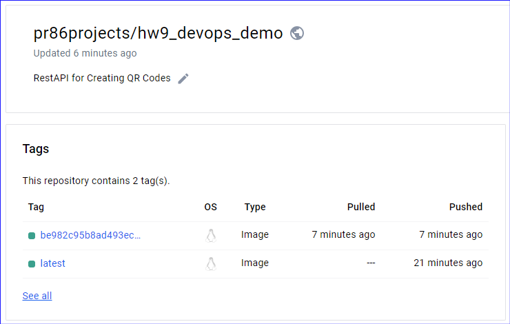

# RestAPI for Creating QR Codes

## Submission
1. Create a new repo on dockerhub "pr86projects/hw9_devops_demo"
2. Modify the production.yml file to point to this new repo
3. Configure GitHub repo environment variables DOCKERHUB_USERNAME and DOCKERHUB_TOKEN
4. Commit and push changes to GitHub https://github.com/pr86-projects/is601-hw9 

DockerHub repo: https://hub.docker.com/repository/docker/pr86projects/hw9_devops_demo/general

# Instructor Videos
* [Rest API Project Overview](https://youtu.be/xEcBKSSXxhQ)
* [QR Code Overview for Assignment](https://youtu.be/E6b9VkQpQ-U)
## Optional but extremely helpful:
1. [Best Series to Learn Bash Scripting Seriously learn this!!!](https://www.youtube.com/playlist?list=PLIhvC56v63IKioClkSNDjW7iz-6TFvLwS)
2.  [Listen to someone else explain FastAPI and go through a project](https://www.youtube.com/watch?v=cbASjoZZGIw)

# Install
1. Clone
2. Make virtual environment:  python3 -m venv venv
3. Activate virtual environment: source venv/bin/activate
4. Install requirements: pip install -r requirements.txt
5. Note: make sure docker is started
6. run pytest locally to check that it works locally
7. Start the app with docker compose up --build
8. Goto http://localhost/docs to view openapi spec documentation
9. Click "authorize" input username: admin password: secret
10. Test making,  retrieving, and deleting QR codes on the spec page. 